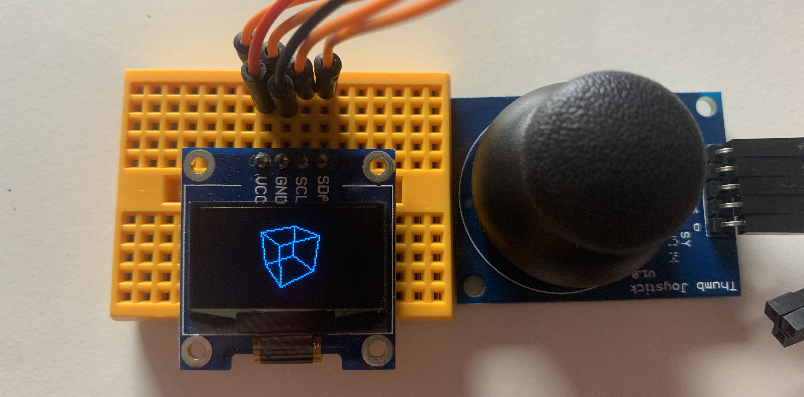

# arduino-cube-renderer
This is a simple 3D renderer with joystick control for microcontrollers, written for the Arduino IDE.

This project was quick and written for fun, and very well may not be the most efficient or tidy way to do this.

## How to use/key variables
As with any Arduino project, simply open it, and upload it to your microcontroller.

However, some microcontrollers, such as those based on the ATmega328p, may not have enough RAM. Microcontrollers with sufficient RAM, such as the ESP32, are recommended.

### Necessary variables
If you are using a display other than the SSD1306/SSD1315, you'll also have to change the u8g2 initialiser accordingly (and potentially the screen dimension constants `gScreenWidth` and `gScreenHeight`).

Additionally, if you would like to use a joystick to control the camera/movement, you will have to change the pin definition constants `joystickX`, `joystickY`, and `joystickButton` if you are not using the pins already defined.
Depending on the tolerances of your joystick, you may also want to adjust the X and Y centres and deadzones (`gJoystickCentreX`, `gJoystickCentreY`, `gJoystickDeadzone`). There is also an option to flip the joystick controls (`gFlippedJoystick`) if you wish to do so. It is enabled by default.

### Other variables
Some variables that may be interesting to tweak are `gFOV`, `gFocalDistance`, `gMovementSpeed`, and `gLookSpeed`.

### Joystick modes
There are three modes for the joystick control which can be cycled through by pressing the joystick button. They are as follows:
1. **Movement control** - changes the position of the camera
2. **Camera control** - changes the pitch and yaw of the camera
3. **Cube rotation/height** - rotates the cube about its centre and also changes its height

## Background
I have been working on a private project which is a C/C++ 3D renderer where all the maths and algorithms have been created by me as a fun challenge/project. After seeing a post on the r/Arduino subreddit of a rotating cube on a display controlled by a potentiometer, I figured I'd implement the core parts of my renderer on the Arduino platform as a fun, quick project. The code is probably rather messy and hard to read, and this is because it was written in the early hours of the morning. I only program occasionally, and have not yet started uni (I start next year), so please (really) bare with me when it comes to reading/understanding the code...

## The maths
An interactive Desmos 3D graph representing the following can be found at https://www.desmos.com/3d/yttht7z51h

### The axes
When looking at the world from a top down view, it appears exactly as a normal 2D graph would. The X- and Y-axes are represented in this manner. The Z-axis extends the graph to 3D, adding height.

### Projecting a point in the world to the screen
Initially, this was made without the ability to look around (no view angles). The XZ-plane was defined to be the plane in which the screen lies. A 3D vector describes the position of the camera. In this example it is assumed to be the origin. Another vector, $f$, describes the focal point of the camera. It is obtained by subtracting the focal distance from the y value of the position vector. From this, a line between a point in the world $p$ and the focal point $f$ and can be stepped along using a parameter $t$ to obtain $p'$, as follows:

$$\begin{aligned}
p'&=p+\overrightarrow{pf}\cdot t\\
\therefore p'&=p+(f-p)t
\end{aligned}$$

However, we would like to obtain the value of $t$ such that $p'$ is on the XZ-plane. This occurs when its y-value equals 0. Putting this information into the equation and using the y-components of the vectors allows us to solve for $t$, as follows:

$$\begin{aligned}
p'&=p+(f-p)t\\
p'.y&=p.y+(f.y-p.y)t\\
0&=p.y+(f.y-p.y)t\\
-p.y&=(f.y-p.y)t\\
t&=\frac{-p.y}{f.y-p.y}\\
\therefore t&=\frac{p.y}{p.y-f.y}\\
\end{aligned}$$

Putting this value for $t$ back into the original equation gives us the point on the screen plane:

$$p'=p+(f-p)\cdot \frac{p.y}{p.y-f.y}$$

### Converting XZ-plane coordinates to screen coordinates
The width of the viewport can be calculated by the equation $w=2d\tan\frac{\theta}{2}$, where $w$ is the screen width, $d$ is the focal distance, and $\theta$ is the horizontal FOV.

The height, $h$, of the viewport can be calculated by the equation $h=w\cdot \frac{screenHeight}{screenWidth}$.

This gives us coordinates on the screen plane which bound the viewport. This can be used to map XZ-plane coordinates to screen coordinates.

### Adding rotation
From here, I saw two clear methods to implement pitch and yaw. Either rotate the screen plane, or rotate the world objects.

As I chose this method simply because I came up with it and not because it is the best way, the easiest way I saw to implement view angles was to rotate the points in the world. This is because it means we are still calculating intersection with the XZ-plane, which is merely when y = 0 and, thus, far easier to do. To rotate the screen plane, it seemed the only way to project a point to this plane would be to find a method to calculate intersection between a line and an arbitrary plane, which sounded like a whole lot more effort.

In order to actually perform the rotations, the points in space are firstly adjusted to have the camera position as their origin. They are then rotated about the Z-axis to implement yaw, followed by a rotation about the X-axis to implement pitch. The origin adjustment is then undone and the projection is done as described earlier. To aid visualisation, the 3D graph linked above may be of assistance.
